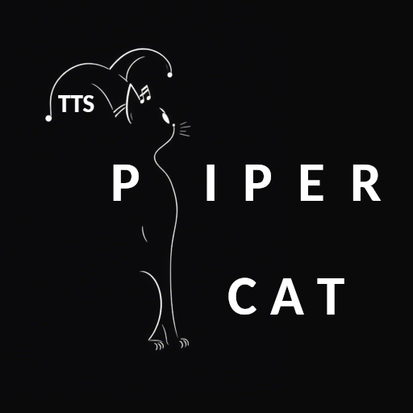

# tts-piper-cat
Piper TTS Cat (no gtts)

if the Cheshire Cat AI lacks the piper dependency and you want to test the plugin without modifying the core, use the plugin:

[KaguraAI audio](./KaguraAI-TTS-piper-cat.wav)

https://github.com/canapaio/apt-cat (apt-get install plugin)

and from the prompt type

:install: piper

ispired plugin

View pazoff's full-sized avatar
Plamen Vatev pazoff

https://github.com/pazoff/Piper-Cat
